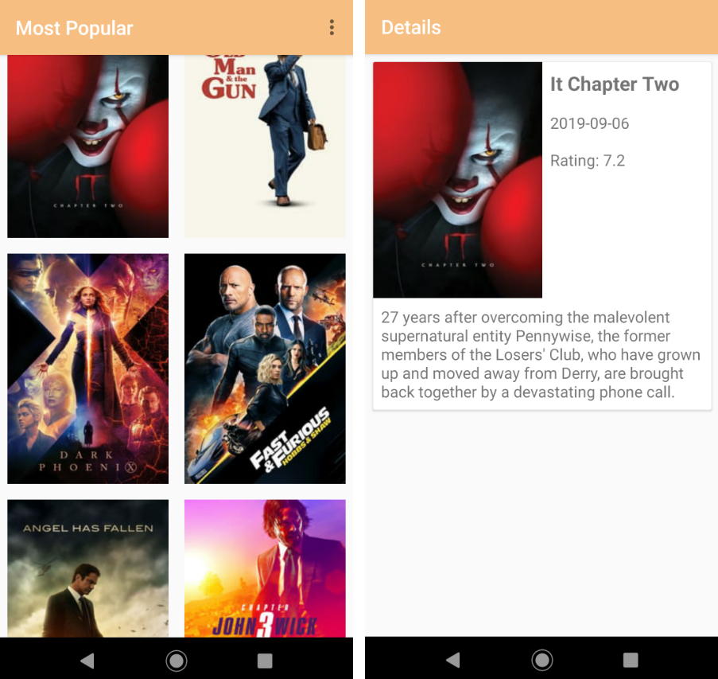

# Filmes Famosos

A API utilizada para consulta dos filmes foi [MovieDB](https://www.themoviedb.org/?language=pt-BR) para poder rodar o código tem que criar um conta no site e inserir a chave da API Movies na classe APIUtils na variável API_KEY.

1 - Ordenado por filmes mais populares, ao clicar no banner é possível ver os detalhes sobre o mesmo.

  

2 - Agora ordenado por filmes mais votados.

  

